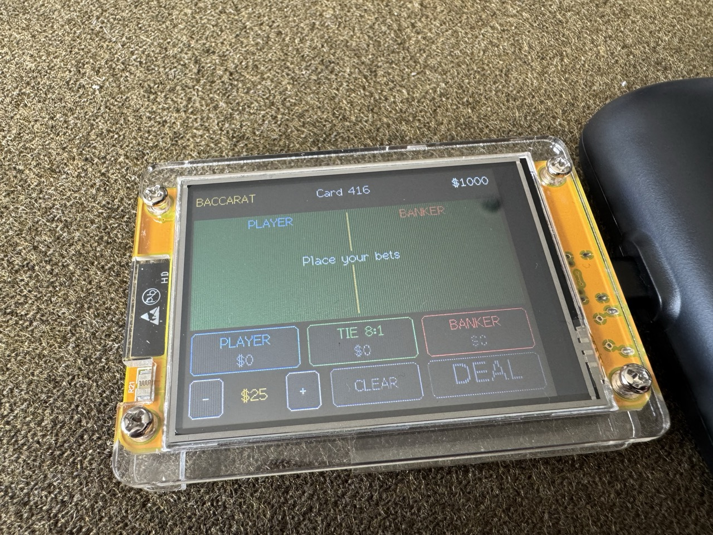
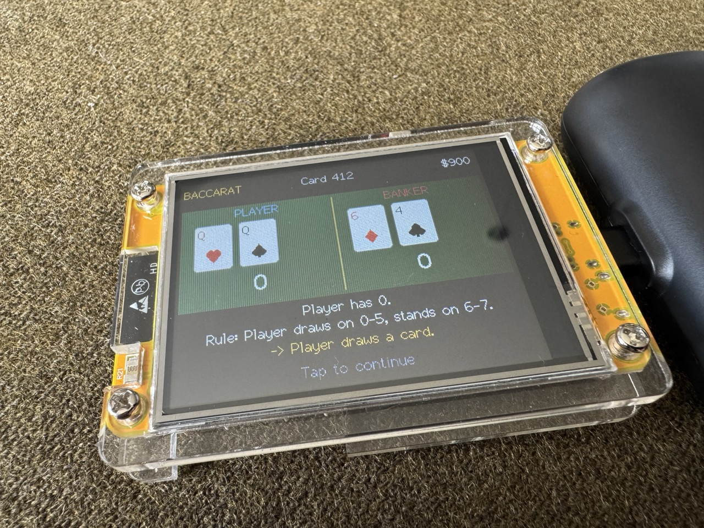
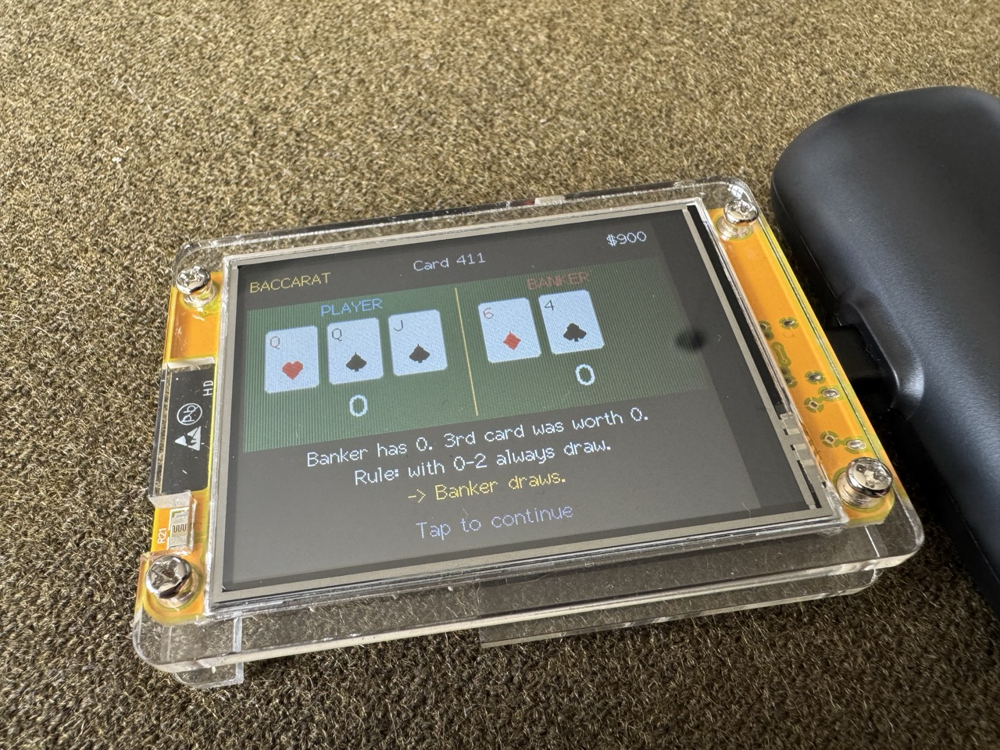
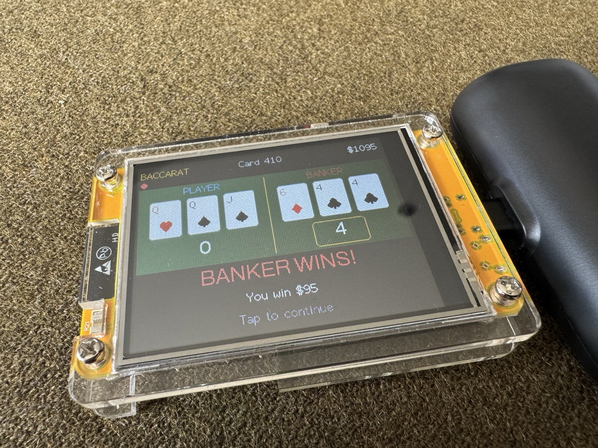

# Cheap Yellow Baccarat

A full punto banco baccarat game for the **Cheap Yellow Display** (CYD, ESP32-2432S028R)
— the inexpensive ESP32 board with a built-in 320×240 touchscreen. Bet with
touch chips, deal, watch the cards flip, and repeat until you're rich or busted.

|  |  |
|:---:|:---:|
| *Place your bets* | *Player draws* |
|  |  |
| *Banker draws* | *Player wins!* |

## Features

- **Real casino rules**: 8-deck shoe, standard third-card tableau, natural 8/9s.
  Player pays 1:1, Banker pays 19:20 (5% commission), Tie pays 8:1 and pushes
  Player/Banker bets.
- **Touch betting**: pick a chip size ($1–$500) and tap the Player, Tie, or
  Banker zones to stack bets. CLEAR takes them back; after a hand the same
  button becomes REBET to repeat your last wager.
- **Bead road**: a scrolling strip of dots tracks recent results (blue = Player,
  red = Banker, green = Tie), just like the scoreboard displays in real casinos.
- **Tutor mode**: an optional setting that pauses the deal to explain each
  third-card drawing rule as it's applied — a painless way to finally learn
  the tableau.
- **High score table**: cash out your bankroll to compete for the top five,
  with an on-screen keyboard for name entry. Scores persist across power cycles.
- **The death chart**: go broke and you're shown a graph of your entire run —
  every peak, every collapse, and the exact moment it all ended. Complete with
  sad trombone.
- **Sound and light**: chip clicks, win/lose jingles, and shuffle sounds on the
  built-in speaker; the RGB LED flashes green when you profit, red when you don't.

## Hardware

Built for the **ESP32-2432S028R** ("Cheap Yellow Display"): an ESP32 with a
2.8" 320×240 TFT (ILI9341 or ST7789 depending on the variant) and an XPT2046
resistive touch controller. Any similar ESP32 + TFT_eSPI-supported display +
XPT2046 touch combination should work with minor adjustments (see
[Adapting to your board](#adapting-to-your-board)).

Optional extras used if present (both standard on the CYD):

- A speaker/amp on GPIO 26 for sound effects
- An RGB LED on GPIOs 4/16/17 (active LOW) for win/lose feedback

## Building

Built with the **Arduino IDE** and the ESP32 Arduino core (3.x).

1. **Install libraries** via the Library Manager:
   - [`TFT_eSPI`](https://github.com/Bodmer/TFT_eSPI)
   - [`XPT2046_Touchscreen`](https://github.com/PaulStoffregen/XPT2046_Touchscreen)
2. **Configure TFT_eSPI for your display.** TFT_eSPI is configured per-board by
   editing `User_Setup.h` (or selecting a setup in `User_Setup_Select.h`) inside
   the library folder. You need the correct driver (`ILI9341_DRIVER` on most
   CYDs — some variants use ST7789) and your display's SPI pins. If you have a
   CYD, ready-made setups are easy to find; see the excellent
   [ESP32-Cheap-Yellow-Display](https://github.com/witnessmenow/ESP32-Cheap-Yellow-Display)
   community repo.
3. **Board settings**: select **ESP32 Dev Module**, the default partition
   scheme is fine. Serial monitor at **115200** baud (the game logs each hand).
4. Open `Cheap_Yellow_Baccarat.ino` and upload.

## How to play

The screen is laid out landscape: a header bar (shoe count and bankroll), the
bead road, the green felt where cards are dealt, and a control panel at the
bottom.

1. **Set your chip size** with the **−** and **+** buttons.
2. **Place bets** by tapping the PLAYER, TIE, or BANKER zones — each tap adds
   one chip. Tap **CLEAR** to take all bets back, or **REBET** (same button,
   shown when the table is empty) to repeat your previous bet.
3. Tap **DEAL**. Cards are revealed in casino order and third cards are drawn
   automatically per the tableau. The winner is highlighted and your bets
   settle.
4. Tap anywhere to continue to the next hand.

You start with **$1000**. Run out and you get the death chart, then a fresh
$1000 rebuy.

### Hidden touches

- **Tap "BACCARAT"** in the top-left corner to open **Settings** (sound on/off,
  tutor mode on/off).
- **Tap your bankroll** in the top-right corner to view the high scores and
  optionally **cash out** — banking your current total for a shot at the
  leaderboard and restarting at $1000.

## Adapting to your board

Everything hardware-specific is near the top of the sketch:

- **Touch pins and calibration**: the `XPT2046_*` pin defines and the
  `RAW_X_MIN/MAX`, `RAW_Y_MIN/MAX` calibration constants. If taps land in the
  wrong place, print raw `ts.getPoint()` values while touching the corners and
  adjust the ranges (swapped or inverted axes are handled by
  `ts.setRotation(...)`).
- **Display pins and driver**: configured in TFT_eSPI's setup file, not in the
  sketch (see [Building](#building)).
- **Speaker and LED pins**: `SPEAKER_PIN` and `LED_R/G/B`. If your board lacks
  them, the sketch still runs — you'll just miss the fanfare. The LED helpers
  assume active-LOW wiring; flip the logic in `ledSet()` if yours differs.
- **Rotation**: the game assumes landscape (`setRotation(1)`, 320×240). Other
  sizes would need layout changes; the coordinates are defined as constants in
  the "Layout" section.

Game state (settings and high scores) is stored in NVS flash via
`Preferences`, so it survives reflashing as long as you don't erase flash.

## Rules reference

Punto banco as implemented here:

- Cards 2–9 count face value, aces count 1, tens and face cards count 0. Hand
  value is the total modulo 10.
- Player and Banker each get two cards. An 8 or 9 (a "natural") on either side
  ends the hand immediately.
- Otherwise the Player draws a third card on 0–5 and stands on 6–7. The Banker
  then draws by the standard tableau, which depends on the Banker's total and
  the value of the Player's third card:

  | Banker total | 0 | 1 | 2 | 3 | 4 | 5 | 6 | 7 | 8 | 9 | (stood) |
  |:---:|:---:|:---:|:---:|:---:|:---:|:---:|:---:|:---:|:---:|:---:|:---:|
  | **0–2** | D | D | D | D | D | D | D | D | D | D | D |
  | **3** | D | D | D | D | D | D | D | D | S | D | D |
  | **4** | S | S | D | D | D | D | D | D | S | S | D |
  | **5** | S | S | S | S | D | D | D | D | S | S | D |
  | **6** | S | S | S | S | S | S | D | D | S | S | S |
  | **7** | S | S | S | S | S | S | S | S | S | S | S |

  Columns are the point value of the Player's third card; **D** = Banker draws,
  **S** = Banker stands. The last column applies when the Player stood (no
  third card): the Banker simply draws on 0–5 and stands on 6–7.
- Highest total wins. Payouts: Player 1:1, Banker 19:20 (commission rounded in
  the house's favor), Tie 8:1; Player and Banker bets push on a tie.
- The shoe is 8 decks, shuffled with the ESP32's hardware RNG, and reshuffled
  when fewer than 16 cards remain.

## License

[MIT](LICENSE)
